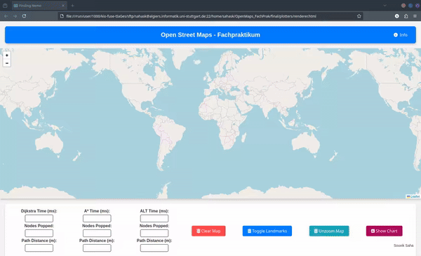
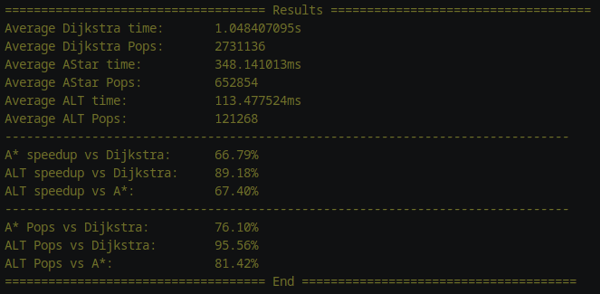

# Open Street Maps Fachpraktikum

## Table of Contents

- [Open Street Maps Fachpraktikum](#open-street-maps-fachpraktikum)
  - [Table of Contents](#table-of-contents)
  - [About](#about)
  - [Getting Started](#getting-started)
    - [Go](#go)
  - [Instructions](#instructions)
    - [Graph Generation](#graph-generation)
    - [Server](#server)
    - [Headless Comparison](#headless-comparison)
    - [Headless Single](#headless-single)

## About

This project is a submission for the OSM Fachpraktikum SS2024. It involves creating and comparing different pathfinding algorithms using OpenStreetMap data.

## Getting Started

To set up and run the project, follow these instructions:

### Go

1. Install Go using the [official Go instructions](https://go.dev/doc/install). The code has been tested with Go version 1.22.6.

2. Once Go is installed, run the following command to install the required libraries and packages:

   ```bash
   go mod tidy
   ```

## Instructions

### Graph Generation

The code will prompt you to generate graphs on the first run or if the files are missing from the `objects` folder. To generate the graphs manually, use:

```bash
go run . graph
```

### Server

To start the server, use:

```bash
go run . server
```

Once the server is running, open `plotters/renderer.html` in your browser. Select any two points on the map. If a path exists between them, the server will return the path. Each algorithm's path is indicated by a different box text color.




### Headless Comparison

To run all algorithms with the same set of points one after the other, use:

```bash
go run . multi <number of point pairs>
```

For example:

```bash
go run . multi 100
```

This command runs Dijkstra, A*, and ALT algorithms sequentially and prints a comparison of the results.



### Headless Single

To run a single algorithm, use:

```bash
go run . single <algo> <number of point pairs>
```

Replace `<algo>` with one of the following:
- `dijkstra` for Dijkstra's algorithm
- `astar` for A* algorithm
- `alt` for ALT algorithm

For example:

```bash
go run . single alt 100
```


